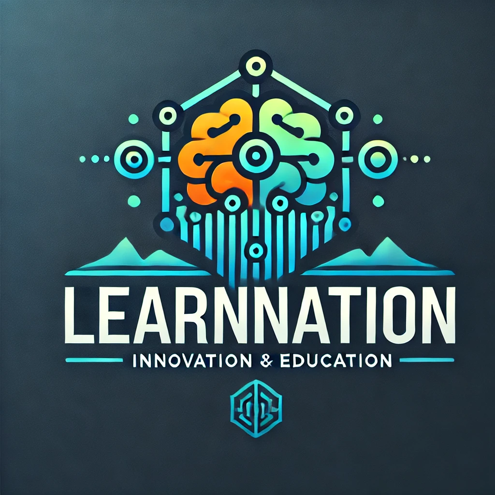

# Pursuit Data Scraping Projects Brief

## Overview
Hey developers! We've got two exciting projects from different departments that need your Python expertise. Both projects involve working with our Pursuit Department'sCodetrack platform data, but they serve different business needs.

## Project Tiers
We've categorized these projects based on complexity:
- **Tier 1 (Entry Level)**: Team Generator - Perfect for developers getting comfortable with basic web scraping and API integration
- **Tier 2 (Advanced)**: Trading Card Generator - Ideal for developers ready to tackle more complex data processing and frontend HTMLgeneration

## Department Needs

### People Operations - Team Generator (Tier 1)
The People Ops team is struggling with manual team formation for sprints. They need an automated solution to create balanced teams while keeping the process fun and engaging. This project focuses on basic data collection and AI-powered team formation.

### Marketing Department - Trading Card Generator (Tier 2)
The Marketing team wants to create engaging "Developer Trading Cards" to showcase our fellows' achievements in a fun, gamified way. This project requires more complex data processing, AI integration, and frontend generation skills. The cards will be used for social media, community engagement, and potentially physical prints.

## Project Selection
Consider your current skill level and interests when choosing your project:
- **Choose Tier 1** if you're comfortable with basic Python scripting and want to focus on core functionality
- **Choose Tier 2** if you're ready to challenge yourself with more complex data processing and frontend development

## Project Impact & Career Growth Opportunities

### These projects serve these key purposes:

1. **Technical Skill Development**
   - **Tier 1 (Team Generator)**: Demonstrates proficiency in web scraping, data processing, and AI integration
   - **Tier 2 (Trading Card Generator)**: Showcases advanced skills in full-stack development, from data collection to frontend generation
   - Strong performance could lead to specialized roles in our Engineering or AI Integration teams

2. **Business Impact & Innovation**
   - **People Operations**: Streamline team formation process, saving hours of manual work
   - **Marketing**: Create engaging content for community building and fellow recognition
   - Successful implementations may be integrated into LearnNation's core operations

3. **Architecture & System Design**
   - Both projects test your ability to:
     - Design scalable solutions
     - Handle data effectively
     - Integrate multiple technologies
     - Consider user experience
   - Demonstrates readiness for more complex system architecture roles

4. **Product Development Experience**
   - Your solutions will serve as prototypes for:
     - **Team Generator**: Future automated team management systems
     - **Trading Card Generator**: Gamified learning and achievement tracking platforms
   - Outstanding implementations may be selected for production development, with original developers participating in the initiatives

### Success Metrics

Your implementation will be evaluated on:
1. **Code Quality**: Clean, maintainable, and well-documented solutions
2. **Technical Execution**: Efficient data handling and API integration
3. **Problem Solving**: Creative solutions to technical challenges
4. **User Experience**: Intuitive output formats and visual design (specifically for Tier 2)

### Growth Potential

These projects align with LearnNation's strategic initiatives in:
- AI Integration
- Automated Operations
- Community Engagement
- Educational Technology Innovation

Strong performers will be considered for leading roles in these areas as we expand our technical capabilities.

## Timeline
Both projects are needed for the upcoming community showcase sprint. Choose based on your comfort level and interest!

## Support
- Technical documentation available for both projects
- API credentials will be provided upon project selection
- Project leads available for questions during implementation

## Next Steps
1. Review both project specifications in detail
2. Select your preferred project
3. Begin planning your project steps

## Technical Specifications

Please review the following technical specifications for each project:
- [Tier 1 Link](./team-generator-spec.md) - Team Generator
- [Tier 2 Link](./trading-card-spec.md) - Trading Card Generator

Reach out to your manager for any questions or clarifications.
